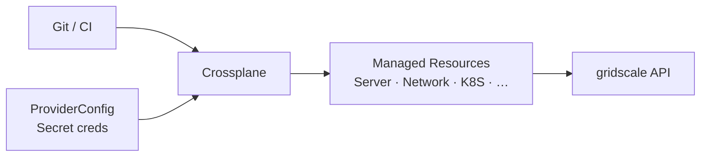

<p align="center">
  
</p>

<p align="center">
<a href="https://github.com/PlatformRelay/provider-gridscale/actions/workflows/ci.yml"></a>
<a href="https://github.com/PlatformRelay/provider-gridscale/actions/workflows/coverage.yml"></a>
<a href="https://github.com/PlatformRelay/provider-gridscale/actions/workflows/e2e.yaml"></a>
<a href="https://github.com/PlatformRelay/provider-gridscale/actions/workflows/gitleaks.yml"></a>
<a href="https://github.com/PlatformRelay/provider-gridscale/actions/workflows/govulncheck.yml"></a>
<a href="https://github.com/PlatformRelay/provider-gridscale/actions/workflows/codeql.yml"></a>
<a href="https://securityscorecards.dev/viewer/?uri=github.com/PlatformRelay/provider-gridscale"></a>
<a href="https://codecov.io/gh/PlatformRelay/provider-gridscale"></a>
<a href="https://github.com/PlatformRelay/provider-gridscale/releases"></a>
<a href="https://marketplace.upbound.io/providers/platformrelay/provider-gridscale"></a>
<a href="https://github.com/orgs/PlatformRelay/packages?repo_name=provider-gridscale"></a>
<a href="https://github.com/PlatformRelay/provider-gridscale/blob/main/go.mod"></a>
<a href="LICENSE"></a>
</p>

<p align="center"><em>gridscale infrastructure as Kubernetes custom resources</em></p>

# provider-gridscale

**Declare servers, networks, load balancers, managed databases, and Kubernetes
clusters in YAML — Crossplane reconciles them against
[gridscale](https://gridscale.io/).** This is an [Upjet](https://github.com/crossplane/upjet)
(v2) provider generated from the
[gridscale Terraform provider](https://registry.terraform.io/providers/gridscale/gridscale/latest).

> **Unaffiliated.** Community [PlatformRelay](https://github.com/PlatformRelay)
> project — **not** affiliated with, endorsed by, or an official product of
> [gridscale GmbH](https://gridscale.io/).

**Docs map:** [docs/README.md](docs/README.md) · [API reference](docs/api/) ·
[ADRs](docs/adr/) · [Roadmap](docs/ROADMAP.md) · [Assurance](docs/assurance.md)

## Why this provider?

- **One control plane** — manage gridscale next to other clouds with the same
  Crossplane claims / compositions / GitOps flow.
- **Cluster *and* namespaced APIs** — `gridscale.platformrelay.io` (cluster) and
  `gridscale.m.platformrelay.io` (namespaced) so multi-tenant teams can own
  their own `ProviderConfig`.
- **32 managed resources / 8 API groups** — servers, storage, networking, PaaS
  databases, K8s, object storage, marketplace apps, and more.
- **Signed packages** — GHCR + Upbound Marketplace publishes are keyless-cosign
  signed with an SBOM (from `v0.2.0`).



## Quick start

Needs a cluster with [Crossplane](https://docs.crossplane.io/latest/software/install/)
and gridscale API credentials (User-UUID + token from the
[gridscale panel](https://my.gridscale.io/)).

```console
kubectl apply -f examples/install.yaml
kubectl apply -f - <<'EOF'
apiVersion: v1
kind: Secret
metadata:
  name: gridscale-creds
  namespace: crossplane-system
type: Opaque
stringData:
  credentials: |
    {"uuid":"<your-user-uuid>","token":"<your-api-token>"}
EOF
kubectl apply -f - <<'EOF'
apiVersion: gridscale.platformrelay.io/v1beta1
kind: ProviderConfig
metadata:
  name: default
spec:
  credentials:
    source: Secret
    secretRef:
      name: gridscale-creds
      namespace: crossplane-system
      key: credentials
EOF
kubectl get providers
```

Package path in [`examples/install.yaml`](examples/install.yaml):

`xpkg.upbound.io/platformrelay/provider-gridscale:v0.2.1`

Also published to GHCR: `ghcr.io/platformrelay/provider-gridscale:v0.2.1`.

**Next:** apply a resource from [`examples/cluster/`](examples/cluster/) or
[`examples/namespaced/`](examples/namespaced/), then `kubectl explain servers`
(or the matching CRD plural).

### Credential JSON

| Key | Required | Description |
| --- | --- | --- |
| `uuid` | yes | gridscale User-UUID |
| `token` | yes | API token with full-access permissions |
| `api_url` | no | Defaults to `https://api.gridscale.io` |

Namespaced `ProviderConfig` / `ClusterProviderConfig` live under
`gridscale.m.platformrelay.io` — see [`examples/namespaced/`](examples/namespaced/).

## Supported resources

32 managed resources across 8 API groups, each served under both the
cluster-scoped and namespaced families. Kind names below are the exact API
server values (Upjet casing) — copy straight into `kind:`.

| API group | Managed resources (`Kind`) |
| --- | --- |
| `gridscale` | `Backupschedule`, `Filesystem`, `Firewall`, `IPv4`, `IPv6`, `Isoimage`, `K8S`, `Loadbalancer`, `Mariadb`, `Memcached` †, `MySQL` †, `Network`, `Paas`, `Postgresql`, `Server`, `Snapshot`, `Snapshotschedule`, `Sqlserver`, `Sshkey`, `Storage`, `Template` |
| `marketplace` | `Application`, `ApplicationImport` |
| `mysql8` | `MySQL8` |
| `object` | `StorageAccesskey`, `StorageBucket` |
| `paas` | `Securityzone` |
| `redis` | `Cache`, `Store` |
| `ssl` | `Certificate` |
| `storage` | `Clone`, `StorageImport` |

† Upstream-deprecated — see [Deprecations](#deprecations).

Authoritative schema: [`package/crds/`](package/crds/) and the generated
[API reference](docs/api/).

### Deprecations

Upstream Terraform deprecations surface in CRD field descriptions. Prefer:

| Deprecated | Replacement |
| --- | --- |
| `securityZoneUuid` / `security_zone_uuid` (PaaS-style) | `networkUuid` / `network_uuid` |
| `Memcached` | Redis `Cache` / `Store` |
| `MySQL` (5.7) | `MySQL8` in the `mysql8` group |
| `K8S` `networkUuid` | Prefer omit, or `k8sPrivateNetworkUuid` — **not** `securityZoneUuid` |
| `Server` `network[].ordering` | Order follows `network` entry order |

## Known limitations

**Terraform datasources** are not generated (Upjet consumes resource schemas
only). For resource-twinned lookups, import with Observe-Only policies:

```yaml
apiVersion: gridscale.gridscale.platformrelay.io/v1alpha1
kind: Network
metadata:
  name: existing-network
spec:
  managementPolicies: ["Observe"]
  forProvider: {}
  providerConfigRef:
    name: default
```

Set the Crossplane external name to the gridscale UUID. Pure lookup
datasources without a resource twin (`backup_list`, `public_network`) have no
equivalent until upstream Upjet grows datasource support. Details:
[docs/assurance.md](docs/assurance.md).

**Live uptest** against a real gridscale lab is operator-gated (no CI secrets
yet) — examples are curated for manual / `/test-examples` runs.

## Developing

```console
go run cmd/generator/main.go "$PWD"   # codegen
make test                             # unit + coverage → cover.out
make reviewable                       # generate + lint + tidy (PR gate)
make run                              # run against a cluster
make build                            # provider binary + xpkg
```

See [`CONTRIBUTING.md`](CONTRIBUTING.md) and [`AGENTS.md`](AGENTS.md).

## Branding

Shipping icon today: gridscale press Bildmarke (see
[`docs/assets/branding/`](docs/assets/branding/)). **Original logo candidates**
for a future swap: [`docs/assets/branding/candidates/`](docs/assets/branding/candidates/).

## Community

| | |
| --- | --- |
| **Contributing** | [CONTRIBUTING.md](CONTRIBUTING.md) |
| **Code of Conduct** | [CODE_OF_CONDUCT.md](CODE_OF_CONDUCT.md) |
| **Governance** | [GOVERNANCE.md](GOVERNANCE.md) |
| **Security** | [SECURITY.md](SECURITY.md) — private reports only |
| **Issues** | [GitHub Issues](https://github.com/PlatformRelay/provider-gridscale/issues) |

## License

Apache License 2.0 — see [LICENSE](LICENSE). Generated with Upjet; wraps the
gridscale Terraform provider under its own license.
