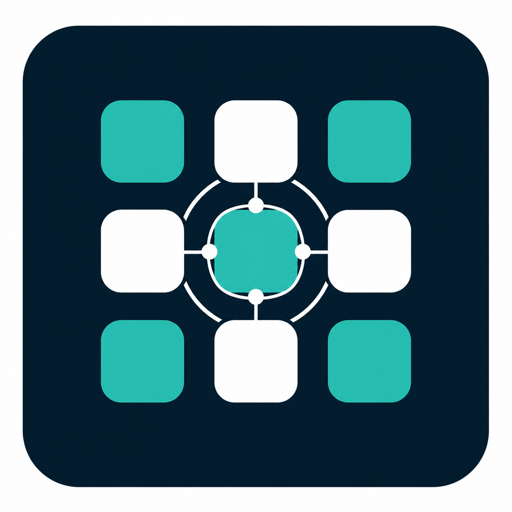
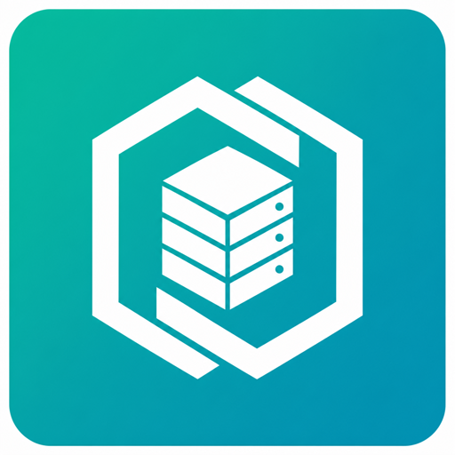
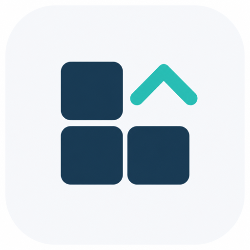
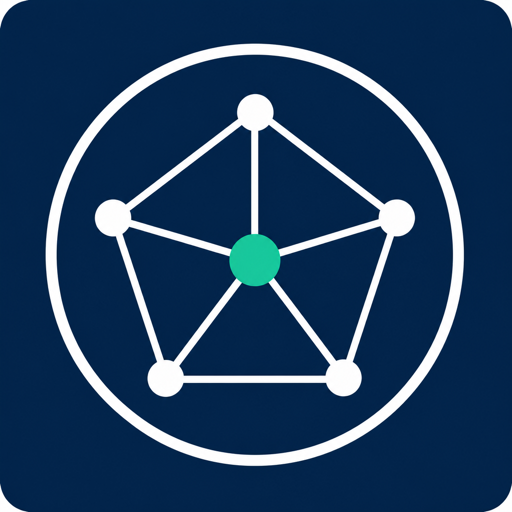

# Logo candidates — pick one

Seven **original** marks for `provider-gridscale` (Marketplace tile + README).
None of these reproduce gridscale GmbH's registered Bildmarke; they are
ecosystem marks *inspired by* grid / control-plane language.

> **Current shipping icon** remains the press Bildmarke under
> [`../`](../) and `extensions/icons/` (D-009b / D-018) until the operator
> picks a candidate and we cut a follow-up release that swaps `iconURI`.

## Gallery

| ID | Preview | Style | Notes |
| --- | --- | --- | --- |
| **A** |  | Teal 3×3 grid + orbit rings on midnight | Closest to the branding prompt; strong at small sizes after SVG trace |
| **B** |  | Hexagon + isometric rack on teal | Crossplane-adjacent hex; reads “infra provider” |
| **C** |  | Lattice cloud of nodes | Emphasises multi-resource control plane |
| **D** |  | Window-pane grid + scale chevron | Light tile; good on white Marketplace cards |
| **E** |  | Constellation / pentagon hub | More abstract; distinct from other providers |
| **F** |  | SVG lattice + hub | Already vector — drop-in for `extensions/icons/icon.svg` |
| **G** |  | SVG orbit + hub square | Already vector — drop-in for `extensions/icons/icon.svg` |

## Recommendation

**Prefer F or G** if you want to ship without a raster→SVG trace step.
**Prefer A** if you want the richest “grid + Crossplane” story and accept a
short polish pass to produce clean SVG paths from the PNG.

Answer the **BRAND-2** decision in [`agent-context/INBOX.md`](../../../../agent-context/INBOX.md).

## After a pick

1. Promote the winner to `extensions/icons/icon.svg` (+ light/dark under `docs/assets/branding/`).
2. Confirm `meta.crossplane.io/iconURI` in `package/crossplane.yaml`.
3. Delete this `candidates/` directory (or keep A–E as archive — operator call).
4. Publish the next package tag so Marketplace picks up the new icon layer.
