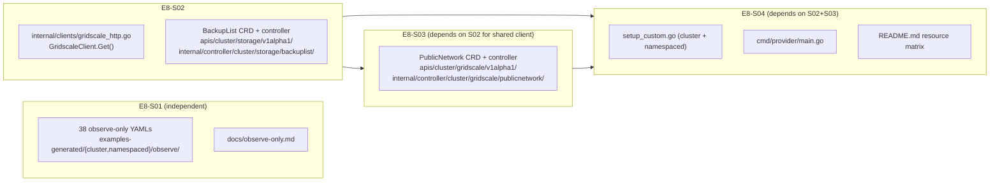

# Design — e8-data-sources (Epic E8)

Architecture decisions behind the three-bucket approach. See `proposal.md` for scope and
`specs/datasources/spec.md` for the traceable REQs.

---

## 1. Why Upjet schema injection fails

Upjet v2's `NewProvider` (in `pkg/config/provider.go`) calls `schema.Provider.Schema()` on the
Terraform plugin binary and extracts only `ResourceSchemas`. `DataSourceSchemas` is never read,
never stored, and never passed to code generators. There is no `include-list` for data sources and
no CRD emitter for them.

If an operator manually injects a data-source schema entry into `resource_schemas` (e.g., via the
config override mechanism), the following happens:

1. Upjet generates a CRD for it — the CRD installs and validates correctly.
2. The generated controller calls `provider.Read()` on the Terraform plugin binary using the
   data-source schema key.
3. The Terraform provider binary (`terraform-provider-gridscale`) has no `ResourcesMap` entry for
   any data source — only for managed resources. The plugin returns a "no such resource type" error.
4. Every `Observe` call fails permanently. The CRD is installed but the controller is non-functional.

**Verdict: do not inject.** The illusion of functionality is worse than the absence of coverage.

---

## 2. Why managementPolicies: [Observe] covers 19 of 21

Crossplane's management policy feature (`--enable-management-policies=true`, defaulting `true` in
`cmd/provider/main.go`) allows any existing managed resource to operate in observe-only mode:

```yaml
spec:
  managementPolicies: ["Observe"]
  providerConfigRef:
    name: default
```

Combined with `crossplane.io/external-name: <UUID>` pointing at an existing gridscale resource, the
controller syncs external state into `status.atProvider` without ever calling `Create`, `Update`, or
`Delete` on the external API.

For 19 of the 21 Terraform data sources, there is a 1:1 Terraform resource equivalent
(`gridscale_storage` data source ↔ `gridscale_storage` resource, etc.). The Crossplane MR for the
resource already exists and is already wired. Observe-Only uses the existing MR's controller — no
new controller, no new CRD, no new Go code.

**Constraint:** the caller must supply the UUID as `crossplane.io/external-name`. Observe-Only does
not perform name→UUID resolution. This is documented in `docs/observe-only.md`.

---

## 3. Why BackupList and PublicNetwork need hand-authored controllers

`backup_list` and `public_network` are the two Terraform data sources with no resource twin:

- `backup_list` queries the storage-backup subresource at `GET /objects/storages/{uuid}/backups`.
  There is no `gridscale_backup` managed resource — backups are not directly manageable objects.
- `public_network` discovers the account's public network via `GET /objects/networks` filtered by
  `network_type == "public"`. There is a `gridscale_network` MR, but the public network is a
  singleton not owned by the user and not represented as a Crossplane `Network` object.

Neither can be covered by the Observe-Only pattern because there is no resource twin to point
`crossplane.io/external-name` at. Both require a custom read-only Crossplane managed resource with a
dedicated controller that calls the gridscale REST API directly.

### Controller pattern (both BackupList and PublicNetwork)

```
ExternalConnecter.Connect(ctx, mg)
  ↓ calls o.SetupFn(ctx, kubeClient, mg)
  ↓ returns terraform.Setup with Configuration map["uuid"]/"token"/"api_url"
  ↓ constructs GridscaleClient{UserID: cfg["uuid"], Token: cfg["token"], APIURL: cfg["api_url"]}

ExternalClient.Observe(ctx, mg)
  ↓ GridscaleClient.Get(ctx, path, &response)
  ↓ populates mg.Status.AtProvider
  ↓ returns managed.ExternalObservation{ResourceExists: true, ResourceUpToDate: true}

ExternalClient.Create/Update/Delete(ctx, mg)
  ↓ returns errors.New("BackupList/PublicNetwork is observe-only; Create/Update/Delete not supported")
```

The `o.SetupFn` is `clients.TerraformSetupBuilder(...)` (already in `internal/clients/gridscale.go`)
— it extracts credentials from the `ProviderConfig` secret, validates `uuid` and `token` are
non-empty, and returns them in `terraform.Setup.Configuration`. The custom connector reads those same
keys: `setup.Configuration["uuid"]`, `setup.Configuration["token"]`,
`setup.Configuration["api_url"]`.

This credential extraction pattern is identical to the Upjet-generated controllers and reuses the
existing tested path in `internal/clients/gridscale.go`.

---

## 4. GridscaleClient — shared HTTP client

**File:** `internal/clients/gridscale_http.go`

```go
type GridscaleClient struct {
    UserID string
    Token  string
    APIURL string
    http   *http.Client
}

func (c *GridscaleClient) Get(ctx context.Context, path string, out any) error
```

Sends `GET {APIURL}/{path}` with headers `X-Auth-UserID` and `X-Auth-Token`. Returns decoded JSON
into `out` on 200; wraps HTTP error status codes as non-nil `error` on 4xx/5xx.

TDD: `internal/clients/gridscale_http_test.go` uses `httptest.NewServer` — written before the
implementation. Tests assert correct header propagation, JSON decode, and 4xx/5xx error paths.

Default `APIURL`: `https://api.gridscale.io` (same as the upstream Terraform provider default).

---

## 5. controller-gen usage and the generation boundary

New hand-authored types in `apis/cluster/storage/v1alpha1/` (BackupList) and
`apis/cluster/gridscale/v1alpha1/` (PublicNetwork) carry controller-gen marker comments:

```go
// +kubebuilder:object:root=true
// +kubebuilder:subresource:status
// +kubebuilder:resource:scope=Cluster
```

Running `controller-gen object:headerFile=hack/boilerplate.go.txt paths="./apis/..."` regenerates:
- `apis/cluster/storage/v1alpha1/zz_generated.deepcopy.go` (storage package — distinct from gridscale)
- `apis/cluster/gridscale/v1alpha1/zz_generated.deepcopy.go` (gridscale package — distinct from storage)
- `apis/namespaced/storage/v1alpha1/zz_generated.deepcopy.go` (namespaced storage)
- `apis/namespaced/gridscale/v1alpha1/zz_generated.deepcopy.go` (namespaced gridscale)

Running `controller-gen crd paths="./apis/..."` produces CRD YAML in `package/crds/`:
- `storage.gridscale.platformrelay.io_backuplists.yaml`
- `storage.gridscale.m.platformrelay.io_backuplists.yaml`
- `gridscale.gridscale.platformrelay.io_publicnetworks.yaml`
- `gridscale.gridscale.m.platformrelay.io_publicnetworks.yaml`

These `zz_generated.deepcopy.go` files are generator output — they must not be hand-edited. They
are distinct per package (storage vs. gridscale) so S02 and S03 have no deepcopy collision.

Note: `make generate` (Upjet codegen) regenerates the **Upjet-controlled** zz files in existing
packages. The new BackupList/PublicNetwork packages are new packages — controller-gen is run
separately (not as part of `make generate`) and only touches the new type files. The stories must
call out this distinction so implementors do not accidentally trigger Upjet codegen.

---

## 6. Non-generated naming convention

Custom controllers and their setup functions use non-`zz_` names:

| File | Purpose |
|------|---------|
| `internal/controller/cluster/setup_custom.go` | `SetupCustom(mgr, o)` — registers BackupList + PublicNetwork cluster controllers |
| `internal/controller/namespaced/setup_custom.go` | `SetupCustom(mgr, o)` — registers namespaced variants |
| `apis/cluster/storage/v1alpha1/backuplist_types.go` | BackupList type definitions (hand-authored) |
| `apis/cluster/storage/v1alpha1/backuplist_register.go` | scheme registration |
| `apis/cluster/gridscale/v1alpha1/publicnetwork_types.go` | PublicNetwork type definitions (hand-authored) |
| `apis/cluster/gridscale/v1alpha1/publicnetwork_register.go` | scheme registration |
| `internal/controller/cluster/storage/backuplist/backuplist.go` | controller + reconciler |
| `internal/controller/cluster/gridscale/publicnetwork/publicnetwork.go` | controller + reconciler |

Namespaced variants mirror the cluster paths under `apis/namespaced/` and
`internal/controller/namespaced/`. The `zz_setup.go` files in each controller package remain
Upjet-generated and untouched.

New types register into their package's existing `SchemeBuilder` — they inherit scheme registration
because they live in already-registered packages:

```go
// In backuplist_register.go — registers into storage/v1alpha1's existing SchemeBuilder
func init() {
    SchemeBuilder.Register(&BackupList{}, &BackupListList{})
}
```

---

## Architecture diagram


